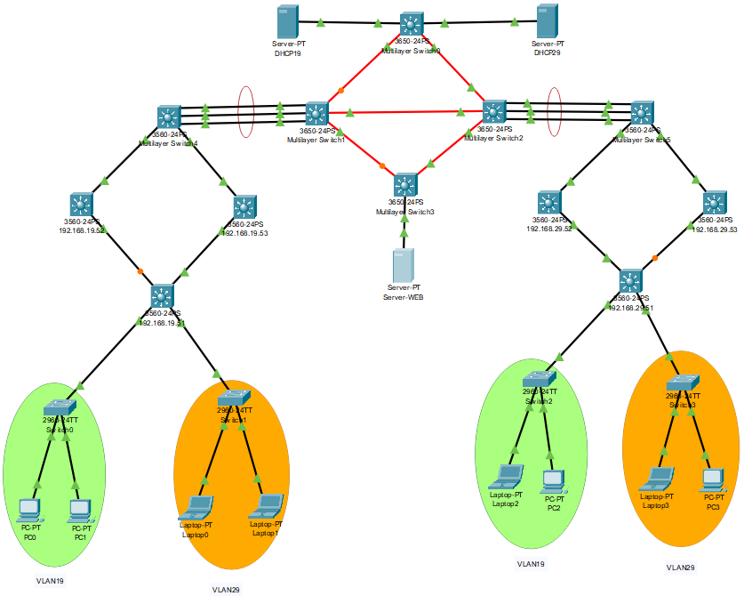
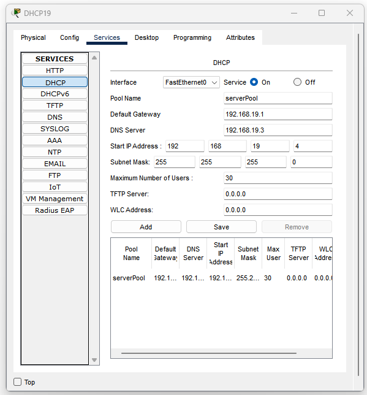
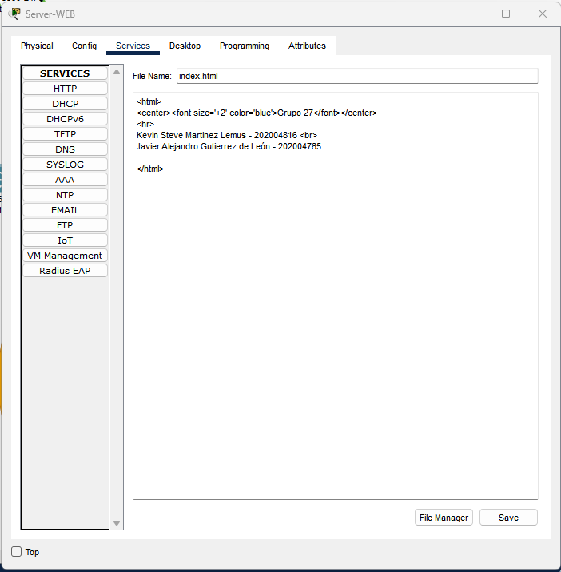
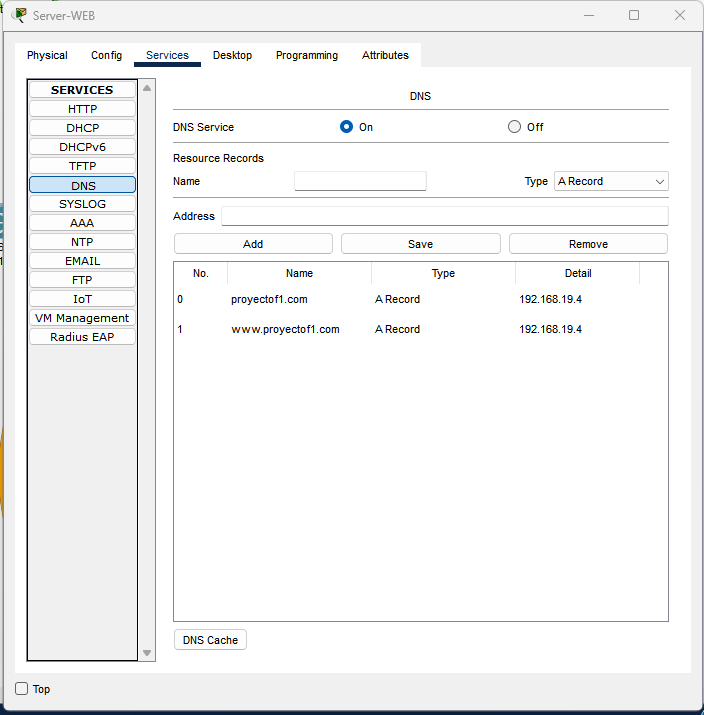
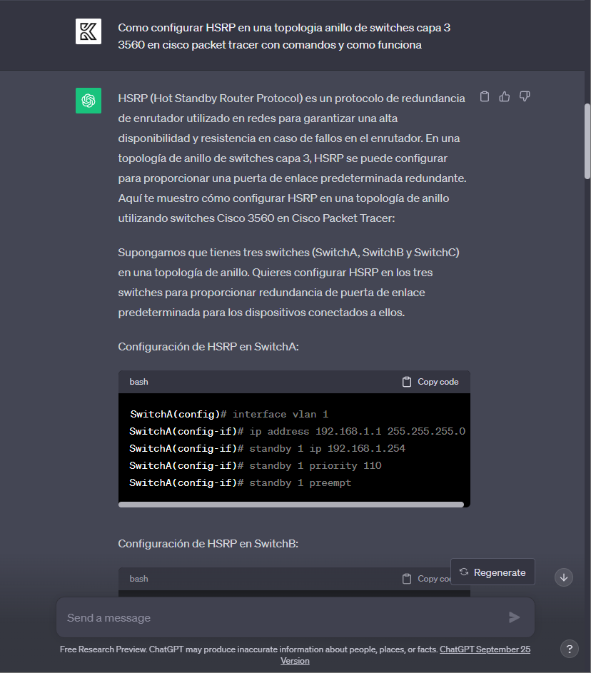
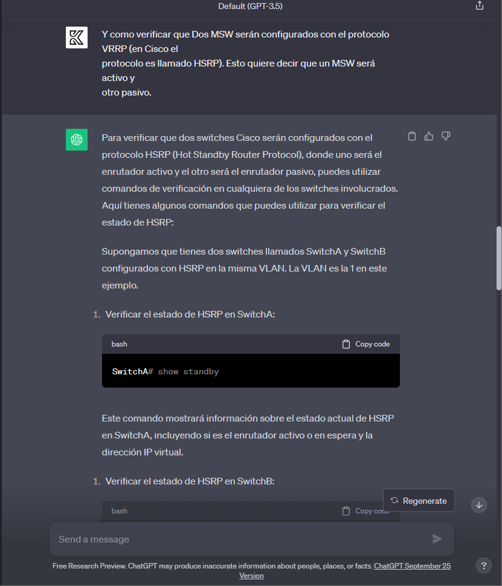
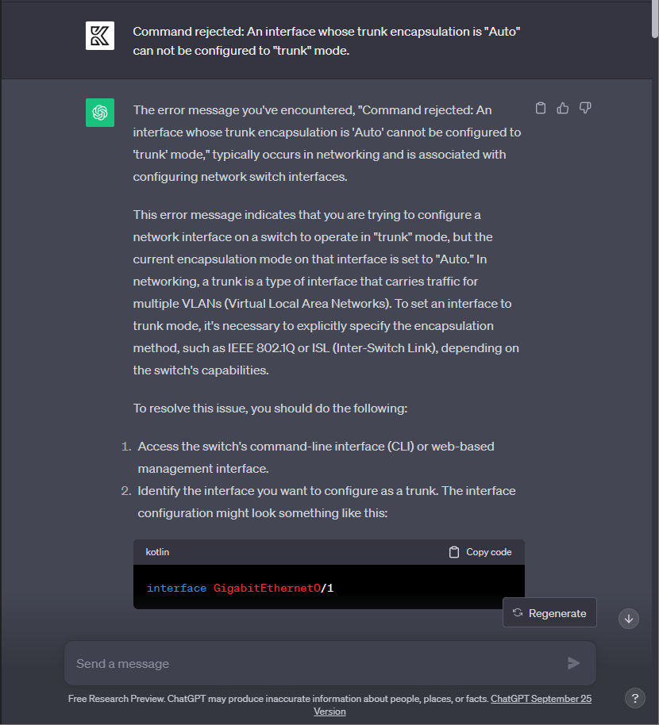
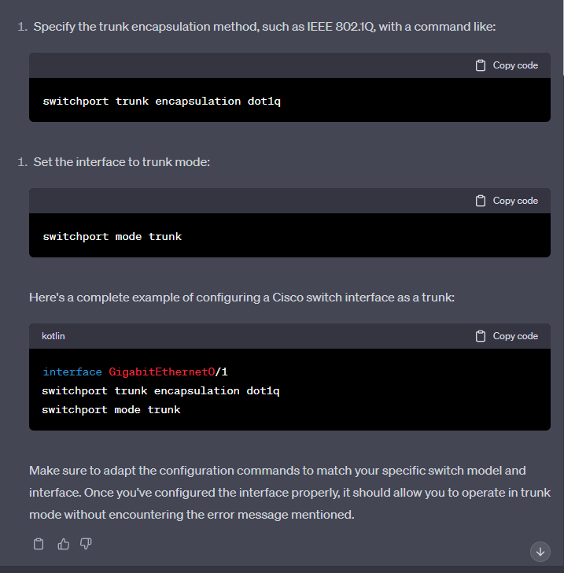

# Proyecto #1 - Grupo #27

---

### Integrantes
- Kevin Steve Martinez Lemus - 202004816
- Javier Alejandro Gutierrez de León - 202004765 

---
### Topología



### Direcciones de VLAN
|                  |VLAN |
|------------------|-----|
| VLAN19           |19   |
| VLAN29           |29   |

### Direcciones de red para los sectores de la VLAN
|           | IP              |
|-----------|-----------------|
| Verde      | 192.168.19.0/24 |
| Anaranjado | 192.168.29.0/24 |

#### Configurando VTP
```
enable
conf t
vtp mode [client | server]
vtp domain g27
end
```

### Habilitando modo trunkal
El modo trunkal es capaz de transmitir datos de múltiples VLANs a través de un solo enlace físico, manteniendo la separación de las VLANs mediante el uso de etiquetas.
```
enable
conf t
interface fastEthernet0/1
switchport trunk encapsulation dot1q
switchport mode trunk
end
```

### Configurando VLANs
```
enable
conf t
vlan 19
name VLAN19
vlan 29
name VLAN29
end
```

### Habilitando modo acceso
El modo acceso se utiliza para conectar dispositivos finales, como computadoras o impresoras a una única VLAN específica sin necesidad de etiquetas adicionales.
```
enable
conf t
interface range f0/11-12
switchport mode access
switchport access vlan 19
description ACC_VLAN19
exit
exit
```

## Interfaz de VLAN

```
conf t
interface vlan 19
ip address 192.168.19.52 255.255.255.0
no shutdown
end
```

### Configurando HSRP 

```
interface vlan 19
ip address 192.168.19.52 255.255.255.0
standby 0 ip 192.168.19.51
standby 0 priority 10
standby 0 preempt
```

```
interface vlan 19
ip address 192.168.19.53 255.255.255.0
standby 0 ip 192.168.19.51
standby 0 priority 10
standby 0 preempt
```


### Configuraciones LACP
```
ena
conf t
interface Port-Channel 2
switchport trunk encapsulation dot1q
switchport mode trunk
no shutdown
exit
int range f0/1-3
channel-protocol lacp
channel-group 2 mode active
switchport trunk encapsulation dot1q
switchport mode trunk
end
wr
```

#### Protocolo OSPF
```
en
conf t
ip routing
router ospf 10
network 192.168.19.0 0.0.0.255 area 10
network 192.168.29.0 0.0.0.255 area 10
exit
exit
wr
```

### Configuración DHCP



### Servidor Web




### Prompts hechos a Chat GPT

Configurar HSRP




Configuracion trunk


