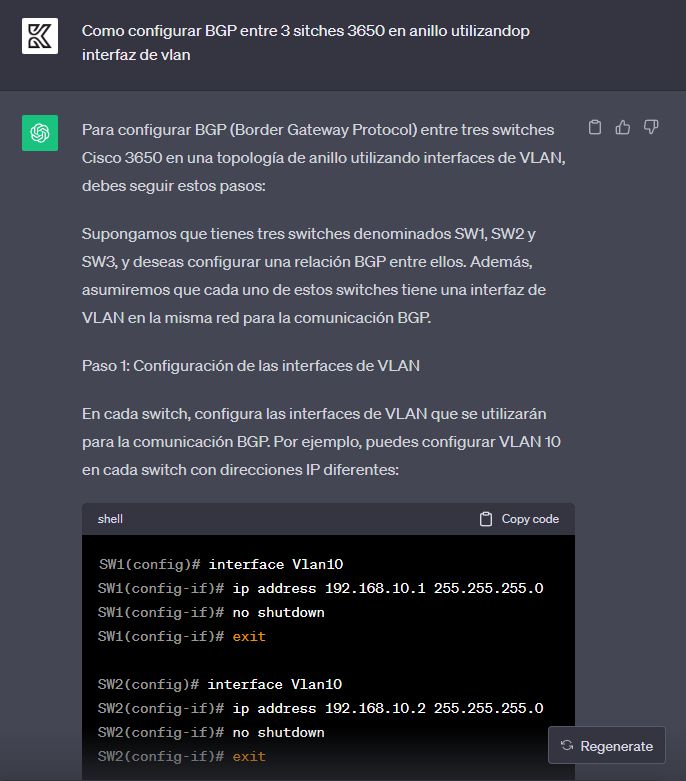

# Proyecto #2 - Grupo #27

---

### Integrantes
- Kevin Steve Martinez Lemus - 202004816
- Javier Alejandro Gutierrez de León - 202004765 

---
### Topología


### Subredes de Rostelecom
| Subred      | Tamaño |
|-------------|--------|
| Mercasa     | 64 |
| Navantia    | 64 |
| WLANLACP1R1 | 4  |
| WLANLACP2R1 | 4  |
| WLANLACP1R2 | 4  |
| WLANLACP2R2 | 4  |
| WLANN       | 4  |
| WLANR1SR1   | 4  |
| WLANR1SR2   | 4  |
| WLANR1SR3   | 4  |
| WLANR2SR1   | 4  |
| WLANR2SR2   | 4  |
| WLANR2SR3   | 4  |

##### IP: 192.168.89.0 /24

| Red         | Gateway        | 1 util         | ulima util     | broadcast      | Rango          | Mascara                       | /               |
|-------------|----------------|----------------|----------------|----------------|----------------|-------------------------------|-----------------|
| Mercasa     | 192.168.89.0   | 192.168.89.1   | 192.168.89.2   | 192.168.89.62  | 192.168.89.63  | 192.168.89.2-192.168.89.62    | 255.255.255.192 | 26 |
| Navantia    | 192.168.89.64  | 192.168.89.65  | 192.168.89.66  | 192.168.89.126 | 192.168.89.127 | 192.168.89.66-192.168.89.126  | 255.255.255.192 | 26 |
| WLANLACP1R1 | 192.168.89.128 | 192.168.89.129 | 192.168.89.129 | 192.168.89.130 | 192.168.89.131 | 192.168.89.129-192.168.89.130 | 255.255.255.252 | 30 |
| WLANLACP2R1 | 192.168.89.132 | 192.168.89.133 | 192.168.89.133 | 192.168.89.134 | 192.168.89.135 | 192.168.89.133-192.168.89.134 | 255.255.255.252 | 30 |
| WLANLACP1R2 | 192.168.89.136 | 192.168.89.137 | 192.168.89.137 | 192.168.89.138 | 192.168.89.139 | 192.168.89.137-192.168.89.138 | 255.255.255.252 | 30 |
| WLANLACP2R2 | 192.168.89.140 | 192.168.89.141 | 192.168.89.141 | 192.168.89.142 | 192.168.89.143 | 192.168.89.141-192.168.89.142 | 255.255.255.252 | 30 |
| WLANN       | 192.168.89.144 | 192.168.89.145 | 192.168.89.145 | 192.168.89.146 | 192.168.89.147 | 192.168.89.145-192.168.89.146 | 255.255.255.252 | 30 |
| WLANR1SR1   | 192.168.89.148 | 192.168.89.149 | 192.168.89.149 | 192.168.89.150 | 192.168.89.151 | 192.168.89.149-192.168.89.150 | 255.255.255.252 | 30 |
| WLANR1SR2   | 192.168.89.152 | 192.168.89.153 | 192.168.89.153 | 192.168.89.154 | 192.168.89.155 | 192.168.89.153-192.168.89.154 | 255.255.255.252 | 30 |
| WLANR1SR3   | 192.168.89.156 | 192.168.89.157 | 192.168.89.157 | 192.168.89.158 | 192.168.89.159 | 192.168.89.157-192.168.89.158 | 255.255.255.252 | 30 |
| WLANR2SR1   | 192.168.89.160 | 192.168.89.161 | 192.168.89.161 | 192.168.89.162 | 192.168.89.163 | 192.168.89.161-192.168.89.162 | 255.255.255.252 | 30 |
| WLANR2SR2   | 192.168.89.164 | 192.168.89.165 | 192.168.89.165 | 192.168.89.166 | 192.168.89.167 | 192.168.89.165-192.168.89.166 | 255.255.255.252 | 30 |
| WLANR2SR3   | 192.168.89.168 | 192.168.89.169 | 192.168.89.169 | 192.168.89.170 | 192.168.89.171 | 192.168.89.169-192.168.89.170 | 255.255.255.252 | 30 |

### Subredes de Akado
| Subred      | Tamaño |
|-------------|--------|
| Sberbank     | 64 |
| Sberbank2   | 64 |
| LACP1R1 | 4  |
| LACP2R1 | 4  |
| Rostec IPV6 |   |

##### IP: 192.168.29.0 /24

|    Red         |      Gateway       |    1 util       |  última util     |    broadcast    |     Rango                           |      Máscara      |     /   |
|--------------- |------------------- |---------------- |------------------ |----------------- |------------------------------------- |------------------ |--------|
| Sberbank       |    192.168.29.0    |    192.168.29.1 |    192.168.29.2  |    192.168.29.62 | 192.168.29.63 192.168.29.2-192.168.29.62 | 255.255.255.192   |   26   |
| Sberbank2      |    192.168.29.64   |    192.168.29.65 |    192.168.29.66 |    192.168.29.126 | 192.168.29.127 192.168.29.66-192.168.29.126 | 255.255.255.192   |   26   |
| LACP1R1        |    192.168.29.128  |    192.168.29.129 |  192.168.29.129  |  192.168.29.130  | 192.168.29.131 192.168.29.129-192.168.29.130 | 255.255.255.252   |   30   |
| LACP2R1        |    192.168.29.132  |    192.168.29.133 |  192.168.29.133  |  192.168.29.134  | 192.168.29.135 192.168.29.133-192.168.29.134 | 255.255.255.252   |   30   |
| Rostec IPV6   | 2001:DB8:1:2::0  | 2001:DB8:1:2::1 | 2001:DB8:1:2::2 | 2001:DB8:1:2:: | 2001:DB8:1:2:: 2001:DB8:1:2::2-2001:DB8:1:2::  |                    |        |


### Subredes de Yota
| Subred      | Tamaño |
|-------------|--------|
| Adif     | 64 |
| LACP1R1 | 4  |
| LACP2R1 | 4  |
| Rosnef IPV6 |   |

##### IP: 192.168.59.0 /24

|   Red         |     Gateway      |     1 util     |  última util   |    broadcast    | Rango                               |     Máscara     |   /   |
|-------------- |------------------ |--------------- |---------------- |----------------- |------------------------------------ |---------------- |-------|
| Adif          |    192.168.59.0   |    192.168.59.1 |    192.168.59.2 |    192.168.59.62 | 192.168.59.63 192.168.59.2-192.168.59.62 | 255.255.255.192 |   26  |
| LACP1R1       | 192.168.59.128    | 192.168.59.129  | 192.168.59.129  | 192.168.59.130  | 192.168.59.131 192.168.59.129-192.168.59.130 | 255.255.255.252 |   30  |
| LACP2R1       | 192.168.59.132    | 192.168.59.133  | 192.168.59.133  | 192.168.59.134  | 192.168.59.135 192.168.59.133-192.168.59.134 | 255.255.255.252 |   30  |
| Rosnef IPV6   | 2001:DB8:1:1::0  | 2001:DB8:1:1::1 | 2001:DB8:1:1::2 | 2001:DB8:1:1:: | 2001:DB8:1:1:: 2001:DB8:1:1::2-2001:DB8:1:1:: |                  |       |


#### LACP
```
en
conf t
interface Port-channel1  # Crear un port-channel
description LACP Trunk to Switch 2  # Descripción opcional
switchport
switchport mode trunk
no shutdown
exit

interface GigabitEthernet1/0/1
description Connection to Switch 2
switchport
switchport mode trunk
channel-group 1 mode active  # Configurar LACP como activo
no shutdown
exit

interface GigabitEthernet1/0/2
description Connection to Switch 2
switchport
switchport mode trunk
channel-group 1 mode active  # Configurar LACP como activo
no shutdown
exit

wr
```

### Configuración de EIGRP
Es un protocolo de enrutamiento de vector de distancia avanzado que se utiliza en redes IP para determinar las mejores rutas de enrutamiento y actualizar las tablas de enrutamiento de los routers. EIGRP es un protocolo propietario desarrollado por Cisco, y es ampliamente utilizado en redes que emplean equipos Cisco.
```
en
conf t
ip routing
router eigrp 100

network 192.168.89.156 0.0.0.3
network 192.168.89.168 0.0.0.3
network 192.168.89.64 0.0.0.63

exit
exit
wr
```

### Configuración OSPF

```
en
conf t
ip routing
router ospf 10
network 192.168.29.0 0.0.0.255 area 10
network 192.168.59.0 0.0.0.255 area 10
network 192.168.89.0 0.0.0.255 area 10
exit
exit
```

### Configuración RIP

```
conf t
router rip
version 2
network 192.168.29.0
no auto-summary
exit
```


### Configuración BGP

```
SW1(config)# router bgp 65001
SW1(config)# bgp log-neighbor-changes
SW1(config-router)# neighbor 192.168.10.2 remote-as 65002
SW1(config-router)# neighbor 192.168.10.3 remote-as 65003
SW1(config-router)# network 192.168.10.0 mask 255.255.255.0
```

### Configuracion Tunnel

```
interface Tunnel0
ipv6 address 3000::1/112
ipv6 rip redv6 enable
tunnel source GigabitEthernet0/0/1
tunnel destination 192.168.1.6
tunnel mode ipv6ip
```

### Prompts hechos a Chat GPT

#### Configurar rip y eigrp


#### Configurar LACP


#### Configurar BGP
