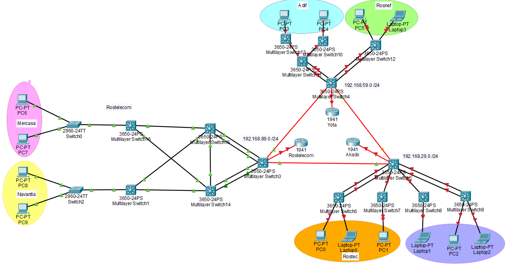
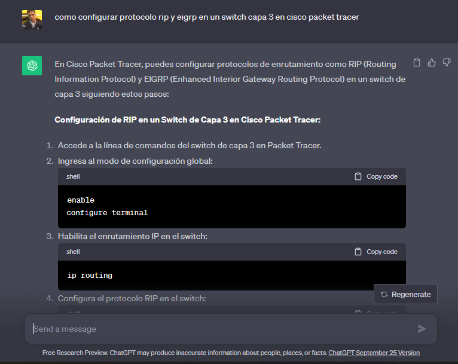
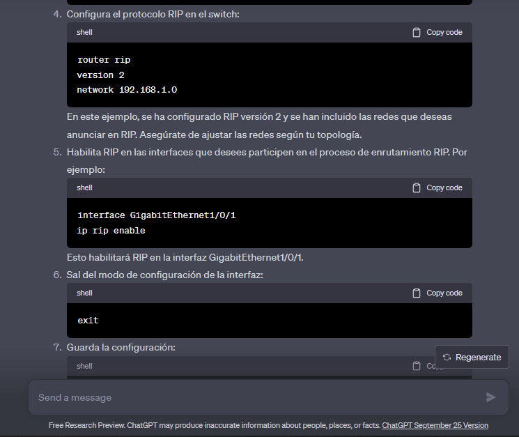
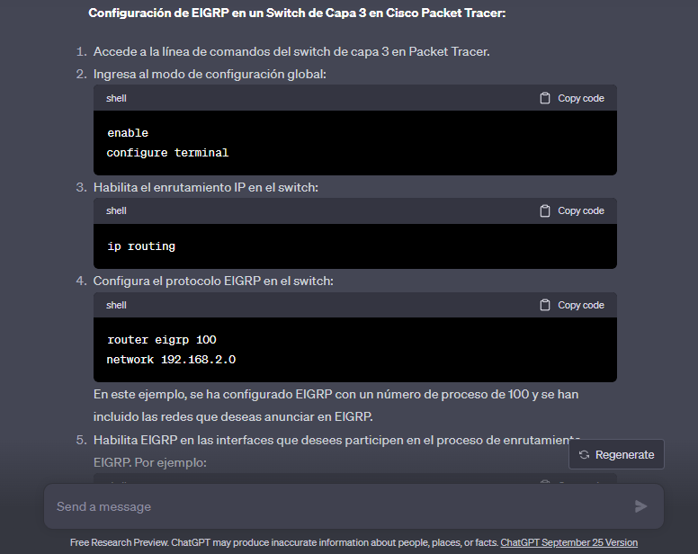
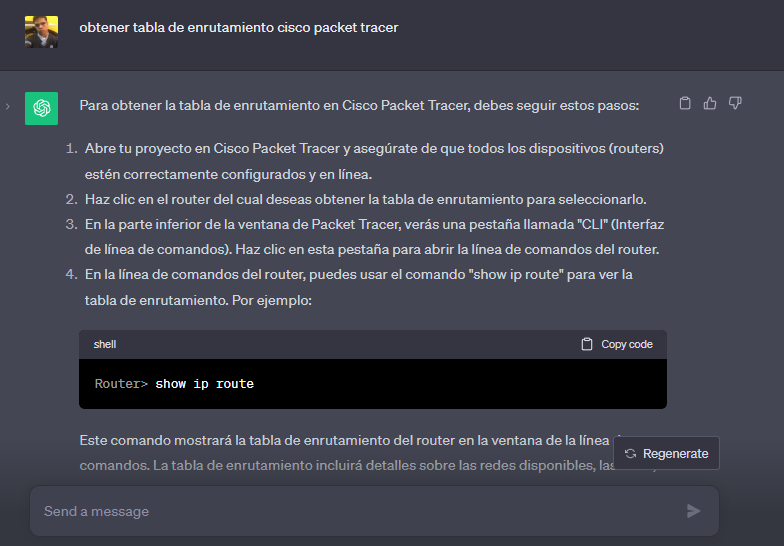
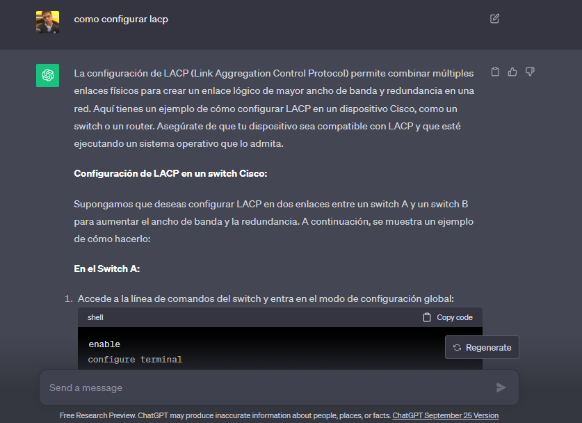

# Proyecto #2 - Grupo #27

---

### Integrantes
- Kevin Steve Martinez Lemus - 202004816
- Javier Alejandro Gutierrez de León - 202004765 

---
### Topología




### Subredes de Akado


### Subredes de Yota


### Subredes de Rostelecom
| Subred      | Tamaño |
|-------------|--------|
| Mercasa     | 64 |
| Navantia    | 64 |
| WLANLACP1R1 | 4  |
| WLANLACP2R1 | 4  |
| WLANLACP1R2 | 4  |
| WLANLACP2R2 | 4  |
| WLANN       | 4  |
| WLANR1SR1   | 4  |
| WLANR1SR2   | 4  |
| WLANR1SR3   | 4  |
| WLANR2SR1   | 4  |
| WLANR2SR2   | 4  |
| WLANR2SR3   | 4  |

##### IP: 192.168.89.0 /24

| Red         | Gateway        | 1 util         | ulima util     | broadcast      | Rango          | Mascara                       | /               |
|-------------|----------------|----------------|----------------|----------------|----------------|-------------------------------|-----------------|
| Mercasa     | 192.168.89.0   | 192.168.89.1   | 192.168.89.2   | 192.168.89.62  | 192.168.89.63  | 192.168.89.2-192.168.89.62    | 255.255.255.192 | 26 |
| Navantia    | 192.168.89.64  | 192.168.89.65  | 192.168.89.66  | 192.168.89.126 | 192.168.89.127 | 192.168.89.66-192.168.89.126  | 255.255.255.192 | 26 |
| WLANLACP1R1 | 192.168.89.128 | 192.168.89.129 | 192.168.89.129 | 192.168.89.130 | 192.168.89.131 | 192.168.89.129-192.168.89.130 | 255.255.255.252 | 30 |
| WLANLACP2R1 | 192.168.89.132 | 192.168.89.133 | 192.168.89.133 | 192.168.89.134 | 192.168.89.135 | 192.168.89.133-192.168.89.134 | 255.255.255.252 | 30 |
| WLANLACP1R2 | 192.168.89.136 | 192.168.89.137 | 192.168.89.137 | 192.168.89.138 | 192.168.89.139 | 192.168.89.137-192.168.89.138 | 255.255.255.252 | 30 |
| WLANLACP2R2 | 192.168.89.140 | 192.168.89.141 | 192.168.89.141 | 192.168.89.142 | 192.168.89.143 | 192.168.89.141-192.168.89.142 | 255.255.255.252 | 30 |
| WLANN       | 192.168.89.144 | 192.168.89.145 | 192.168.89.145 | 192.168.89.146 | 192.168.89.147 | 192.168.89.145-192.168.89.146 | 255.255.255.252 | 30 |
| WLANR1SR1   | 192.168.89.148 | 192.168.89.149 | 192.168.89.149 | 192.168.89.150 | 192.168.89.151 | 192.168.89.149-192.168.89.150 | 255.255.255.252 | 30 |
| WLANR1SR2   | 192.168.89.152 | 192.168.89.153 | 192.168.89.153 | 192.168.89.154 | 192.168.89.155 | 192.168.89.153-192.168.89.154 | 255.255.255.252 | 30 |
| WLANR1SR3   | 192.168.89.156 | 192.168.89.157 | 192.168.89.157 | 192.168.89.158 | 192.168.89.159 | 192.168.89.157-192.168.89.158 | 255.255.255.252 | 30 |
| WLANR2SR1   | 192.168.89.160 | 192.168.89.161 | 192.168.89.161 | 192.168.89.162 | 192.168.89.163 | 192.168.89.161-192.168.89.162 | 255.255.255.252 | 30 |
| WLANR2SR2   | 192.168.89.164 | 192.168.89.165 | 192.168.89.165 | 192.168.89.166 | 192.168.89.167 | 192.168.89.165-192.168.89.166 | 255.255.255.252 | 30 |
| WLANR2SR3   | 192.168.89.168 | 192.168.89.169 | 192.168.89.169 | 192.168.89.170 | 192.168.89.171 | 192.168.89.169-192.168.89.170 | 255.255.255.252 | 30 |

#### LACP
```
en
conf t
interface Port-channel1  # Crear un port-channel
description LACP Trunk to Switch 2  # Descripción opcional
switchport
switchport mode trunk
no shutdown
exit

interface GigabitEthernet1/0/1
description Connection to Switch 2
switchport
switchport mode trunk
channel-group 1 mode active  # Configurar LACP como activo
no shutdown
exit

interface GigabitEthernet1/0/2
description Connection to Switch 2
switchport
switchport mode trunk
channel-group 1 mode active  # Configurar LACP como activo
no shutdown
exit

wr
```

### Configuración de EIGRP
Es un protocolo de enrutamiento de vector de distancia avanzado que se utiliza en redes IP para determinar las mejores rutas de enrutamiento y actualizar las tablas de enrutamiento de los routers. EIGRP es un protocolo propietario desarrollado por Cisco, y es ampliamente utilizado en redes que emplean equipos Cisco.
```
en
conf t
ip routing
router eigrp 100

network 192.168.89.156 0.0.0.3
network 192.168.89.168 0.0.0.3
network 192.168.89.64 0.0.0.63

exit
exit
wr
```


### Prompts hechos a Chat GPT

#### Configurar rip y eigrp






#### Configurar LACP
