# Práctica #1 - Grupo #27

---

### Integrantes
- Kevin Steve Martinez Lemus - 202004816
- Javier Alejandro Gutierrez de León - 202004765 

---
### Topología
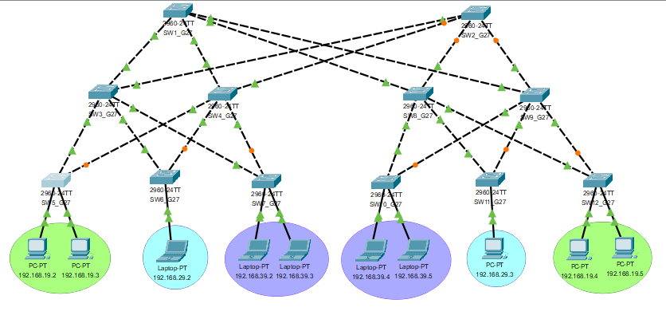

### Direcciones de red y VLAN
|               | IP              |VLAN |
|---------------|-----------------|-----|
| Primaria      | 192.168.19.0/24 |19   |
| Básicos       | 192.168.29.0/24 |29   |
| Diversificado | 192.168.39.0/24 |39   |

### Nombres y passwords de los switches
#### Colocando nombre al switch
```
enable
conf t
hostname SW1_G27
exit
exit
```

#### Colocando password y encriptándola
```
enable
conf t
enable secret redes2sgrupo27
line con 0
password redes2sgrupo27
login
exit
service password-encryption 
exit
```

#### Configurando VTP
```
enable
conf t
vtp mode [client | server]
vtp domain g27
end
```

### Configurando VLANs
```
enable
conf t
vlan 19
name PRIMARIA
vlan 29
name BASICOS
vlan 39
name DIVERSIFICADO
exit
exit
```

### Habilitando modo trunkal
El modo trunkal es capaz de transmitir datos de múltiples VLANs a través de un solo enlace físico, manteniendo la separación de las VLANs mediante el uso de etiquetas.
```
enable
conf t
interface fastEthernet0/1
switchport mode trunk
exit
exit
```

### Habilitando modo acceso
El modo acceso se utiliza para conectar dispositivos finales, como computadoras o impresoras a una única VLAN específica sin necesidad de etiquetas adicionales.
```
enable
conf t
interface range f0/11-12
switchport mode access
switchport access vlan 19
exit
exit
```

### Seguridad de interfaces de red
```
enable
conf t
interface fastEthernet0/11
switchport port-security macaddress 0090.2BD7.5CBB
exit
exit
```

### Configurando STP
```
enable
conf t
spanning-tree mode [rapid-pvst | pvst]
end
```

### Guardar
```
    wr
o 
    write
```

### Ver VLAN
```
    show vlan
```

### Ver configuración STP
```
    show spanning-tree summary
```

### Ver configuración VTP
```
    show vtp status
```

### Ver configuración de interfaces
```
    show interfaces status
```

### STP y RSTP
|Escenario|Protocolo Spanning-Tree | Red Primaria | Red Básicos    | Red Diversificado |
|---------|------------------------|--------------|----------------|-------------------|
|1        |PVST                    | 34.54 seg    |  33.99 seg     |  34.19 seg        |
|2        |RPVST                   |  8.41 seg    |   9.46 seg     |   9.93 seg        |

##### Justificación
La elección de RSTP (Rapid-PVST) sobre STP (PVST) se basa en su comprobado tiempo de convergencia más rápido, como demostraron las pruebas realizadas en un entorno con las 3 VLAN. La velocidad de adaptación de RSTP minimiza la interrupción en caso de cambios en la red, lo que resulta esencial para mantener la conectividad y el rendimiento. RSTP es la elección idónea para garantizar una red robusta y de alta disponibilidad.

### Prompts hechos a Chat GPT
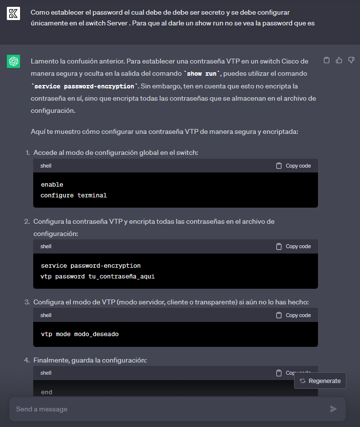
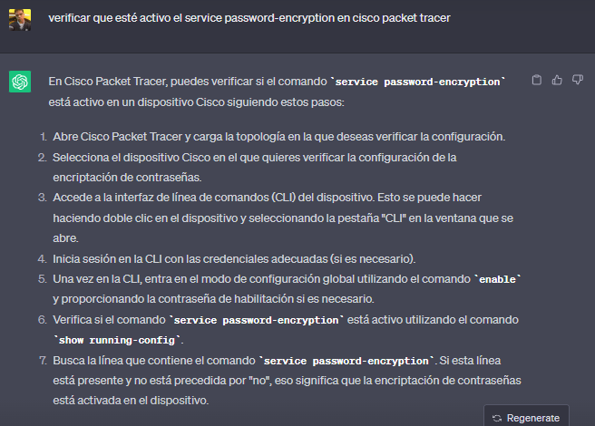
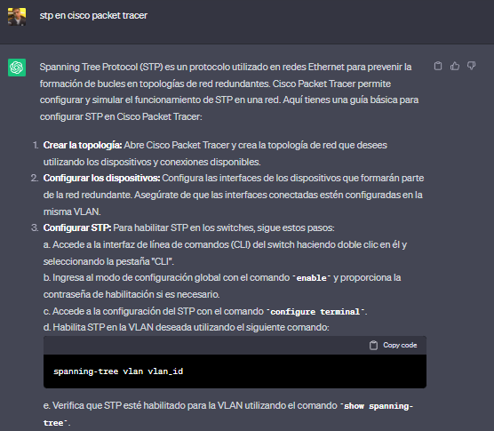
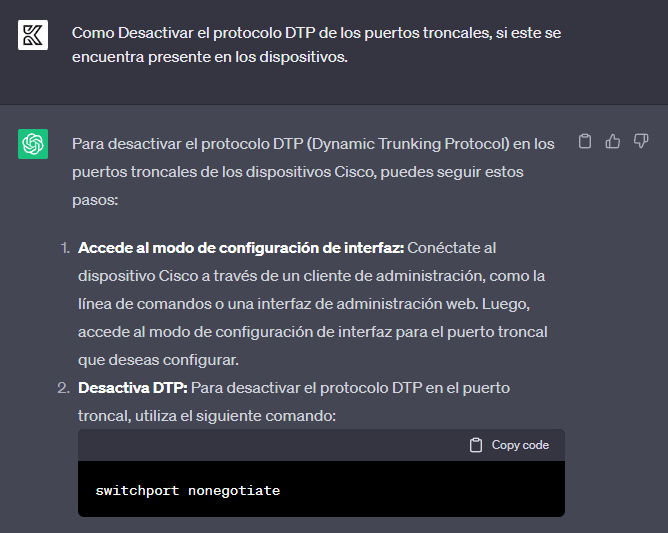

### Pruebas

#### Prueba PVST VLAN 19
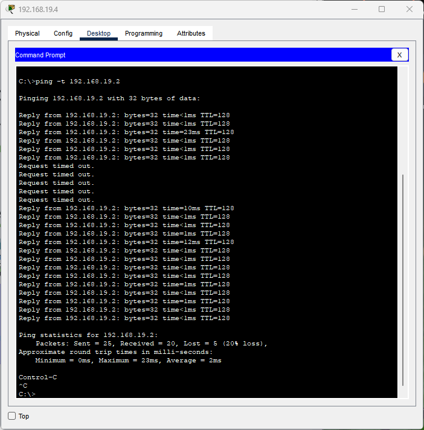
#### Prueba RPVST VLAN 19
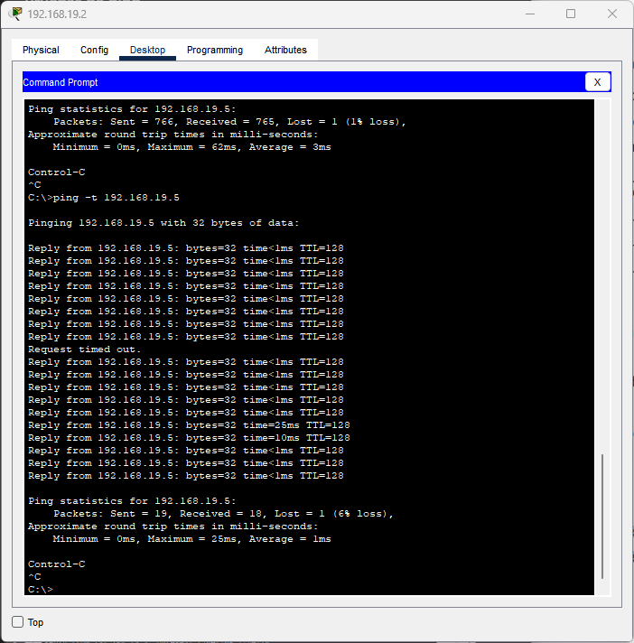

#### Prueba PVST VLAN 29
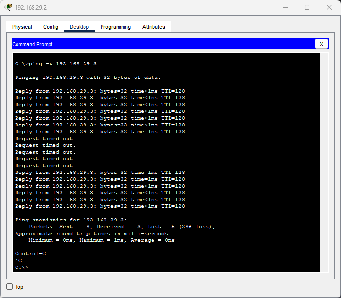
#### Prueba RPVST VLAN 29
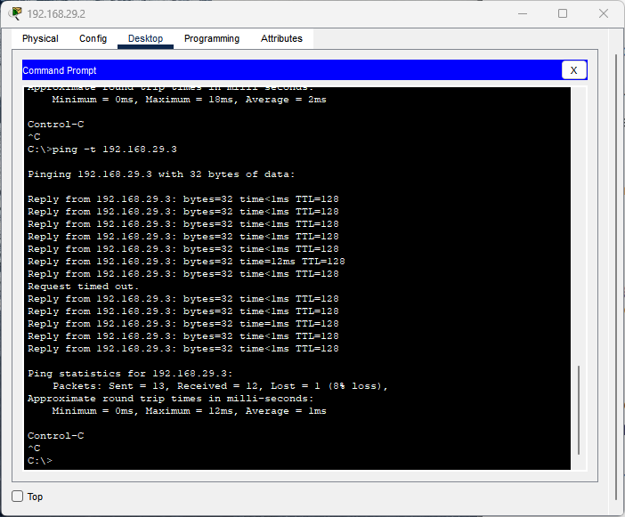

#### Prueba PVST VLAN 39
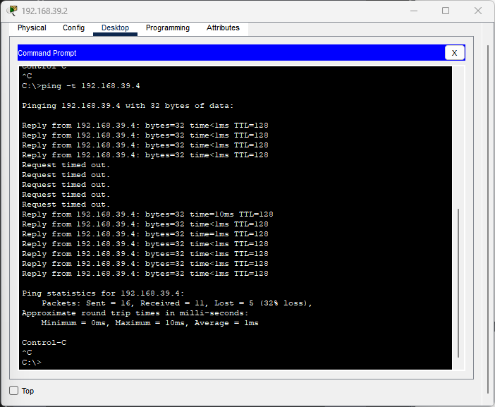
#### Prueba RPVST VLAN 39
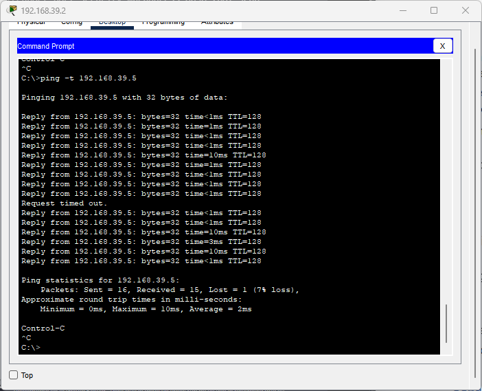