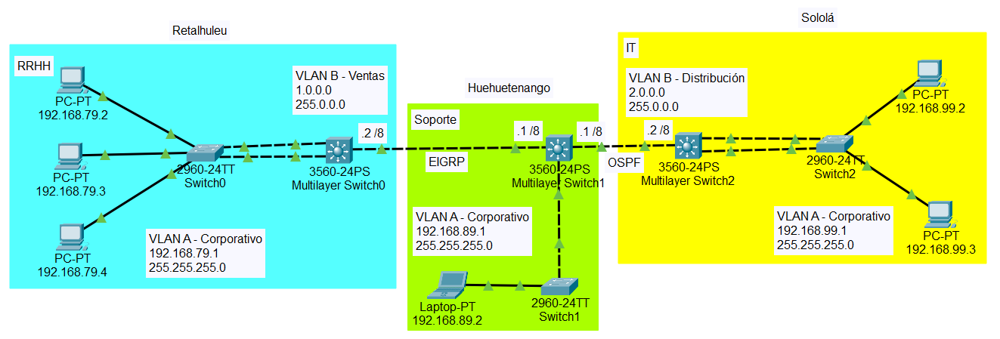
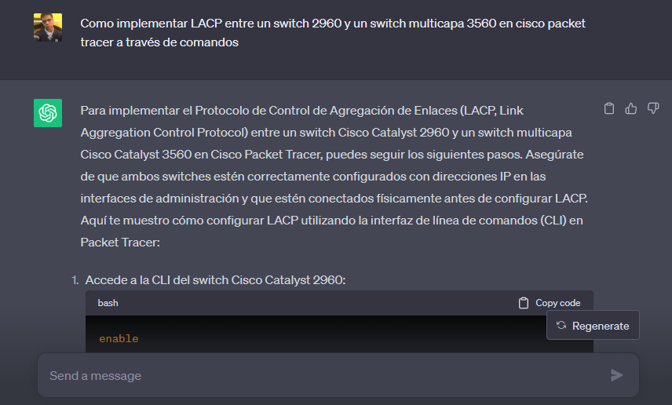
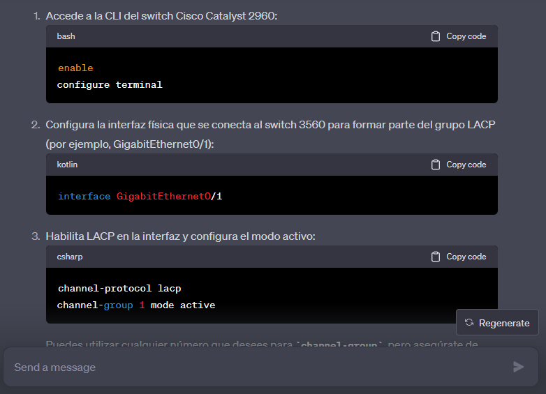
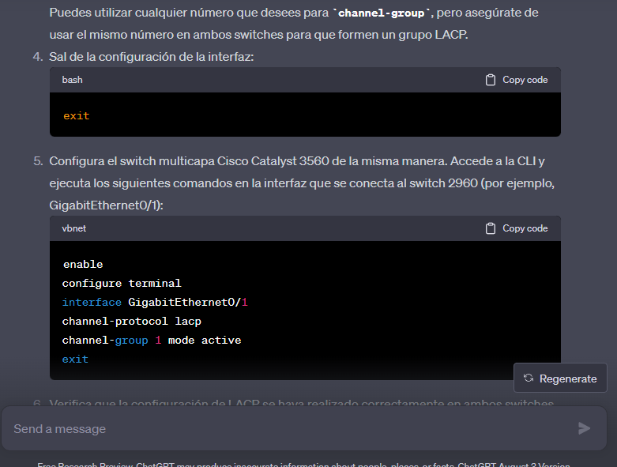
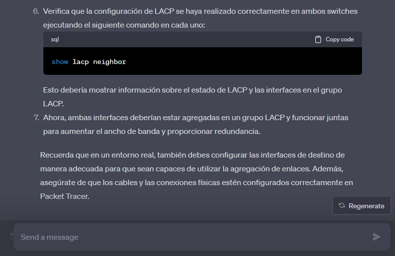
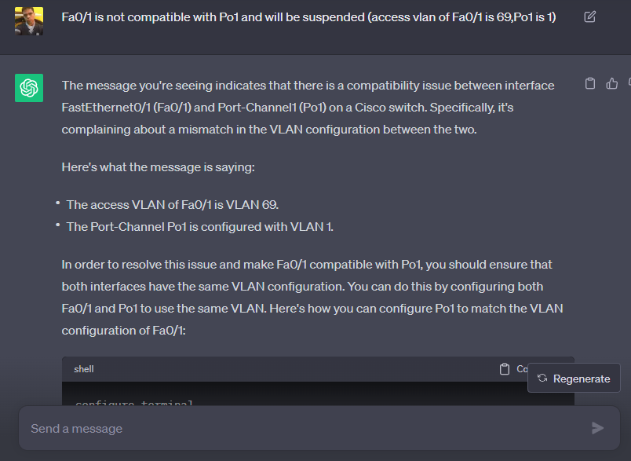
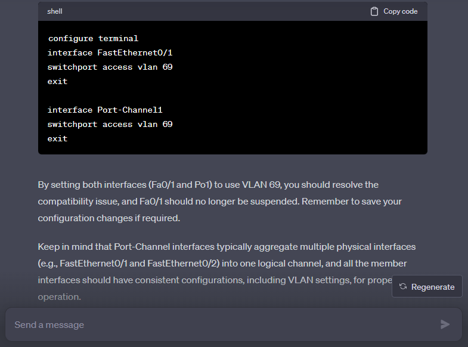
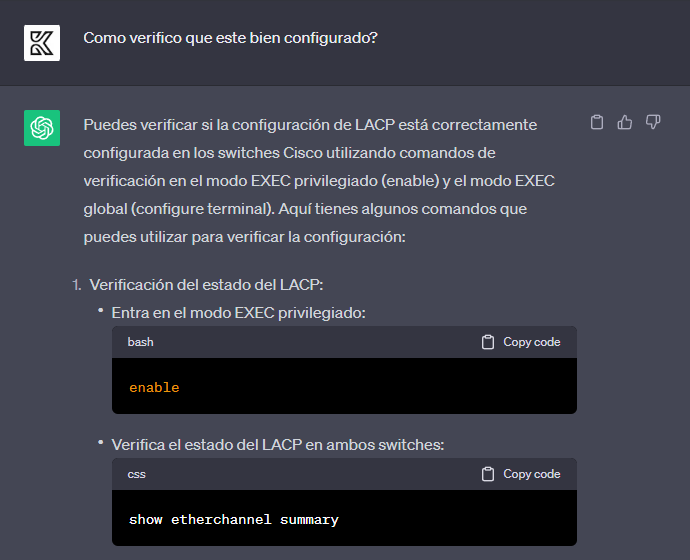

# Práctica #2 - Grupo #27

---

### Integrantes
- Kevin Steve Martinez Lemus - 202004816
- Javier Alejandro Gutierrez de León - 202004765 

---
### Topología


### Direcciones de VLAN
|                  |VLAN |
|------------------|-----|
| Corporativo      |69   |
| Ventas           |19   |
| Distribución     |29   |

### Direcciones de red para los sectores de la VLAN Corporativa
|           | IP              |
|-----------|-----------------|
| RRHH      | 192.168.79.0/24 |
| Soporte   | 192.168.89.0/24 |
| IT        | 192.168.99.0/24 |

### Configurando VLANs

#### Switch Multicapa 0 (Ubicado en Retalhuleu)

##### Creando las VLANs
```
ena
conf t
vlan 69
name Corporativo
exit
vlan 19
name Ventas
exit
do sh vlan brief
```

##### Asignando las VLANs
```
int vlan 69
ip address 192.168.79.1 255.255.255.0
no shutdown
exit

int f0/1
switchport access vlan 69
switchport mode access
description ACC_VLAN69
exit

int f0/2
switchport access vlan 69
switchport mode access
description ACC_VLAN69
exit

int vlan 19
ip address 1.0.0.2 255.0.0.0
no shutdown
exit

int g0/1
switchport access vlan 19
switchport mode access
description ACC_VLAN19
exit
```

#### Switch Multicapa 1 (Ubicado en Huehuetenango)

##### Creando las VLANs
```
ena
conf t
vlan 19
name Ventas
exit
vlan 29
name Distribucion
exit
vlan 69
name Corporativo
exit
do sh vlan brief
```

##### Asignando las VLANs
```
int vlan 19
ip address 1.0.0.1 255.0.0.0
no shutdown
exit

int g0/1
switchport access vlan 19
switchport mode access
description ACC_VLAN19
exit

int vlan 29
ip address 2.0.0.1 255.0.0.0
no shutdown
exit

int g0/2
switchport access vlan 29
switchport mode access
description ACC_VLAN29
exit

int vlan 69
ip address 192.168.89.1 255.255.255.0
no shutdown
exit

int f0/1
switchport access vlan 69
switchport mode access
description ACC_VLAN69
exit
```

#### Switch Multicapa 2 (Ubicado en Sololá)

##### Creando las VLANs
```
ena
conf t
vlan 29
name Distribucion
exit
vlan 69
name Corporativo
exit
do sh vlan brief
```

##### Asignando las VLANs
```
int vlan 29
ip address 2.0.0.2 255.0.0.0
no shutdown
exit

int g0/2
switchport access vlan 29
switchport mode access
description ACC_VLAN29
exit

int vlan 69
ip address 192.168.99.1 255.255.255.0
no shutdown
exit

int f0/1
switchport access vlan 69
switchport mode access
description ACC_VLAN69
exit

int f0/2
switchport access vlan 69
switchport mode access
description ACC_VLAN69
exit
```

#### Switch 0 (Ubicado en Retalhuleu)

##### Creando las VLANs
```
ena
conf t
vlan 69
name Corporativo
exit
do sh vlan brief
```

##### Asignando las VLANs
```
int f0/1
switchport access vlan 69
switchport mode access
description ACC_VLAN69
exit

int f0/2
switchport access vlan 69
switchport mode access
description ACC_VLAN69
exit

int f0/11
switchport access vlan 69
switchport mode access
description ACC_VLAN69
exit

int f0/12
switchport access vlan 69
switchport mode access
description ACC_VLAN69
exit

int f0/13
switchport access vlan 69
switchport mode access
description ACC_VLAN69
exit
```

#### Switch 1 (Ubicado en Huehuetenango)

##### Creando las VLANs
```
ena
conf t
vlan 69
name Corporativo
exit
do sh vlan brief
```

##### Asignando las VLANs
```
int f0/1
switchport access vlan 69
switchport mode access
description ACC_VLAN69
exit

int f0/11
switchport access vlan 69
switchport mode access
description ACC_VLAN69
exit
```

#### Switch 2 (Ubicado en Sololá)

##### Creando las VLANs
```
ena
conf t
vlan 69
name Corporativo
exit
do sh vlan brief
```

##### Asignando las VLANs
```
int f0/1
switchport access vlan 69
switchport mode access
description ACC_VLAN69
exit

int f0/2
switchport access vlan 69
switchport mode access
description ACC_VLAN69
exit

int f0/11
switchport access vlan 69
switchport mode access
description ACC_VLAN69
exit

int f0/12
switchport access vlan 69
switchport mode access
description ACC_VLAN69
exit
```

### Protocolos de enrutamiento

| Punto Inicial | Punto final   | Protocolo |
|---------------|---------------|-----------|
| Retalhuleu    | Huehuetenango | EIGRP     |
| Huehuetenango | Sololá        | OSPF      |

#### Protocolo EIGRP (Para Switch multicapa 0 y 1)
```
en
conf t
ip routing
router eigrp 20
network 2.0.0.0
network 1.0.0.0
network 192.168.79.0
network 192.168.89.0
network 192.168.99.0
no auto-summary
exit
exit
show run
```

#### Protocolo OSPF (Para Switch multicapa 1 y 2)
```
en
conf t
ip routing
router ospf 10
network 2.0.0.0 0.0.0.255 area 10
network 1.0.0.0 0.0.0.255 area 10
network 192.168.79.0 0.0.0.255 area 10
network 192.168.89.0 0.0.0.255 area 10
network 192.168.99.0 0.0.0.255 area 10
exit
exit
show run
```

### Configuraciones LACP
```
ena
conf t
interface Port-Channel 2
switchport access vlan 69
exit
int f0/1
channel-protocol lacp
channel-group 2 mode active
exit
int f0/2
channel-protocol lacp
channel-group 2 mode active
exit
exit
wr
```

### Prompts hechos a Chat GPT
Prompt para la configuración de LACP





Prompt para solucionar error de Port-Chanel al configurar LACP



Prompt para verificar la configuracion LACP


